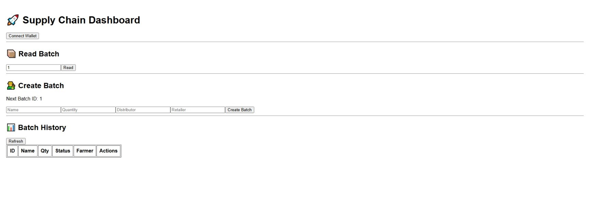

# Option title   

Blockchain-Based Supply Chain Tracking System    
**Blockchain Supply Chain Monitoring and Tracking System**   
**Design and Implementation of a Decentralized Supply Chain dApp**    
**SupplyChain Dashboard: Smart Contract-Based Logistics Tracking**    
**Decentralized Supply Chain Management System Using Solidity and React**    
CoffeeChain: Farm-to-Retail Product Traceability dApp    
**Blockchain Supply Chain Tracker with React, Solidity, and MetaMask**    

---

## Tags 

`Blockchain`, `Supply Chain Management`, `Solidity`, `Smart Contract`, `Sepolia`, `React`, `MetaMask`, `Ethereum` 

---

## TL;DR

TO BE DRAFTED 

---

## Key Highlights  

TO BE DRAFTED 

---

## Core Capabilities  

TO BE DRAFTED 

---

## Target Users & Use Cases  

TO BE DRAFTED 

---

## Architecture (High-Level)  

TO BE DRAFTED 

---

## Architecture Diagram (Deployment workflow and Application flow)

### Deployment workflow  

TO BE DRAFTED   

###  Runtime user workflow (the dApp)  / Application flow  

TO BE DRAFTED  

---

## Design Principles  

TO BE DRAFTED  

---

## Installation Instructions

This publication has a [GitHub code repository](https://github.com/micag2025/Supply_Chain_project.git) that is attached also under the Code section.  

### Prerequisites  

Install:
- Node.js (>= 18)
- MetaMask browser extension
- Remix IDE (to deploy contract) ?   

### Clone and install  

```bash   
git clone https://github.com/micag2025/Supply_Chain_project.git
cd Supply_Chain_project
```

### Environment variables  

Set environment variables (keys) in .env or your environment. See example `.env.example`.  

```bash  
REACT_APP_CONTRACT= YOUR_DEPLOYED_CONTRACT_ADDRESS  
```  
---

## Running the Application  

Launch the `UI Web Decentralized Application (DApp)`  / Get the app URL  
Start the UI Web DAapp  

```bash  
npm start
```

### Open in browser  

DApp will provide a local URL. Open it in your browser. From the UI Web DAapp user interface, You can now interact with the ADK AI Developer

DApp will provide a local URL. Open it in your browser. You can now interact with the Supply Chain Dashboard, from the UI Web DApp.  

### Understanding Advanced Instructions  

The dashboard is characterised by (This enhanced instruction pattern includes)    

✔ 1. **Dashboard (Selection role account?)**         
   - `Wallet connection`      
   - `Role detection`           

✔ 2. **Read Batch (manual lookup)**     
   - user enters an `ID (of the batch?)`      
   - fetches one batch directly from blockchain  
   - useful for `verification/debugging`  

✔ 3. **Overview Table (batch history)**    
   - `shows ALL batches`    
   - comes from scanning or events  
   - displays: `id`, `name`, `quantity`, `state`, `addresses`  

✔ 4. **Create Batch (Farmer)**  
   - creates `new batch on-chain`  
   - triggers `BatchCreated` event  
   - automatically updates table  

✔ 5. **Ship Batch (Distributor)**    
   - visible only if `wallet = distributor` and  `state = Created`  

✔ 6. **Deliver Batch (Retailer)**    
   - visible only if `wallet = retailer` and  `state = Shipped`  

> IMP Other option to describe the dashboard The  full UI becomes:

🧭 DASHBOARD  
- Wallet connection  
- Role detection  
📦 CREATE SECTION
- Farmer only  
📊 OVERVIEW TABLE
- all batches live  
🔍 READ BATCH
- search by ID  
🚚 ACTIONS (inside table)
- Ship (Distributor only)  
- Deliver (Retailer only)  
 
---

## Examples Usage UI  

### UI Web DApp

 

### Example 1 : Create and Read Batch 

 ![Create_Read_Batch]

### Example 2 

SCRENNSHOT TO BE ENCLOSED 

### Example 3 

SCRENNSHOT TO BE ENCLOSED

### Example 4 

SCRENNSHOT TO BE ENCLOSED  

---  

## Limitations & Workarounds  
